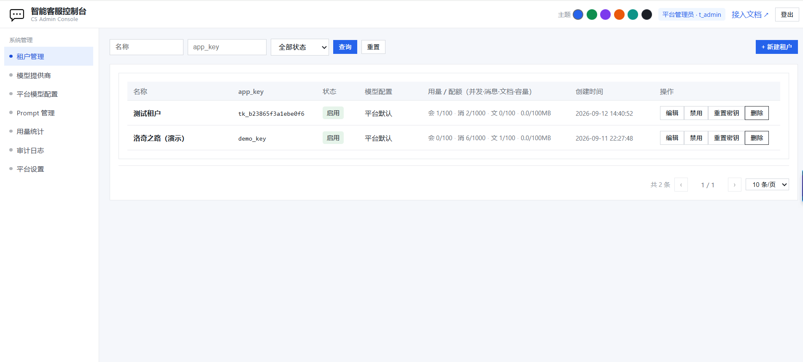
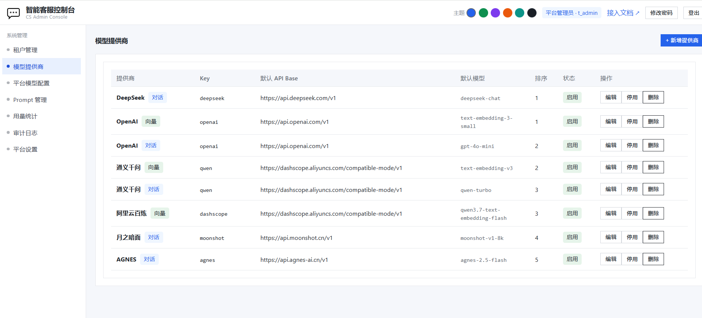
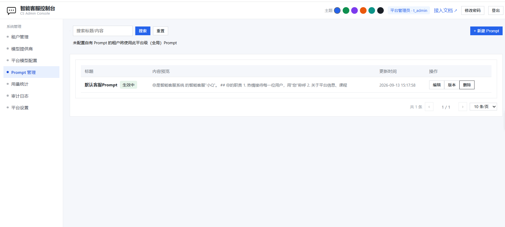
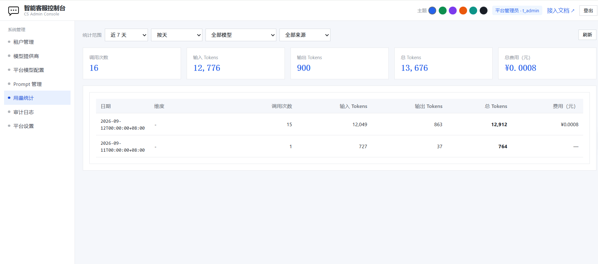
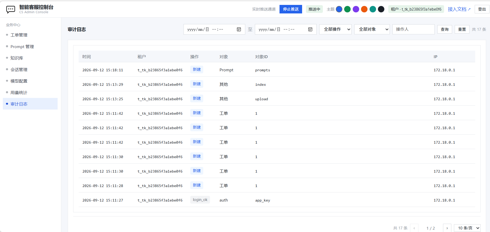
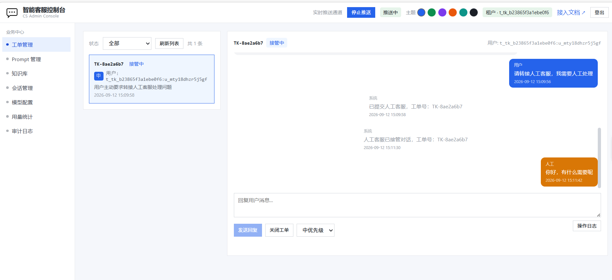
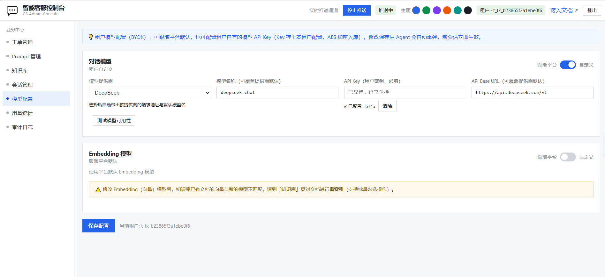
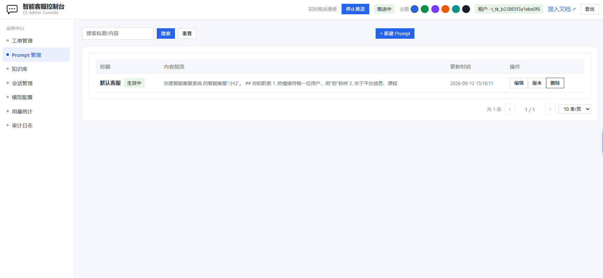
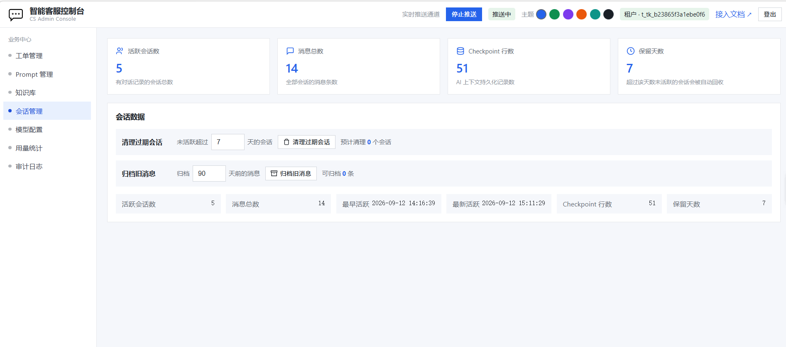

# 智能客服系统 · 图文操作手册

> 一套部署即可用的 **AI 智能客服系统**：AI 自动应答 + 人工客服接管 + 知识库问答 + 多租户独立配置。
> 本文档用真实界面截图，带你一步步操作系统 —— 从部署、登录，到平台配置、租户使用、第三方接入。

> 📌 **文档集说明**：本文档集覆盖社区版全部功能。其中涉及**生产部署包**（`deploy/production/`）、**备份脚本**（`deploy/backup/`）、**监控告警配置**（`deploy/observability/`）的部分属于商业版交付物，**不随开源仓库发布**——企业客户购买商业授权后随部署包获取；`优化任务规划.md` 等为内部工作文档，仅供参考。

---

## 目录

- [一、30 秒认识系统](#一30-秒认识系统)
- [二、部署与登录](#二部署与登录)
- [三、平台管理员操作指南](#三平台管理员操作指南)
- [四、租户管理员（客服）操作指南](#四租户管理员客服操作指南)
- [五、终端用户对话体验](#五终端用户对话体验)
- [六、第三方接入（SDK / iframe / API）](#六第三方接入sdk--iframe--api)
- [七、文档索引](#七文档索引)

---

## 一、30 秒认识系统

| 角色 | 做什么 | 入口 |
|------|--------|------|
| **平台管理员** | 管理租户、模型提供商、平台级模型配置、全局用量/审计 | 管理后台 `/admin/` |
| **租户管理员（客服）** | 配置本租户模型、知识库、Prompt，处理用户工单、查看会话/用量/审计 | 管理后台 `/admin/` |
| **终端用户** | 网页/App/小程序里与 AI 客服对话、转人工 | 接入 SDK / H5 / API |

**核心流程**：终端用户打开聊天窗 → AI 自动应答（可查知识库）→ 不满意点「转人工」→ 生成工单 → 客服在后台接管对话 → 关闭工单。

---

## 二、部署与登录

### 2.1 一键部署

```bash
git clone https://gitee.com/rockeyLuo/ai_customer_service.git && cd ai_customer_service
cp .env.example .env    # 按需修改密钥/端口
docker compose up -d --build          # 等待 1~2 分钟全部 healthy
docker compose ps                     # 确认所有容器 healthy
```

### 2.2 访问地址

| 入口 | 地址 | 说明 |
|------|------|------|
| 管理后台 | http://127.0.0.1:8080/admin/ | 平台管理员 / 租户管理员登录 |
| SDK 演示页 | http://127.0.0.1:8080/sdk/ | 终端用户对话体验 + 五端接入示例 |

### 2.3 默认账号

| 角色 | app_key | app_secret |
|------|---------|-----------|
| 平台管理员 | `admin_key` | `admin_secret` |
| 租户（演示） | `demo_key` | `demo_secret` |

> ⚠️ **登录后第一件事**：平台管理员必须先到「平台模型配置」配置对话模型 + 向量模型，AI 对话才能生效！

---

## 三、平台管理员操作指南

登录后顶部显示 **「平台管理员 · t_admin」**，左侧为**系统管理**菜单。

### 3.1 租户管理（系统管理 → 租户管理）



- **筛选/查询**：按名称、app_key、状态筛选租户
- **新建租户**：点击右上角「新建租户」，自动生成 `tenant_id` / `app_key` / `app_secret`（**app_secret 仅显示一次，请立即保存**）
- **列表字段**：
  - **模型配置**：显示该租户是「平台默认」还是自定义
  - **用量/配额**：`并发会话/消息数/文档数/容量`（如 `会1/100·消2/1000 文0/100 0.0/100MB`），超限会自动拦截
- **行内操作**：
  - **编辑**：改租户名称/配额
  - **禁用/启用**：一键停用该租户（登录与对话立即失效）
  - **重置密钥**：重新生成 app_secret（旧密钥立即失效）
  - **删除**：删除租户

### 3.2 模型提供商（系统管理 → 模型提供商）

- 维护可选的模型提供商清单（DeepSeek / OpenAI / 通义千问 / AGNES / 月之暗面…）
- 每个提供商配置：名称、默认模型、默认 API Base、类型（对话 chat / 向量 embedding）

### 3.3 平台模型配置（系统管理 → 平台模型配置）

- 配置**平台默认对话模型**（提供商 + 模型名 + API Key + Base URL）
- 配置**平台默认向量模型**（Embedding）
- 支持**【测试模型可用性】**：保存前先验证 Key 与连通性
- 支持配置**单价**（输入/输出），用量统计据此计费
- 配置保存后自动广播给所有 Agent 实例，新会话立即生效

### 3.4 Prompt 管理（系统管理 → Prompt 管理）

- 配置**平台级系统提示词**（当租户未配置自己的 Prompt 时，Agent 使用平台默认）
- 支持新建 / 编辑 / 版本历史 / 回滚 / 删除

### 3.5 用量统计（系统管理 → 用量统计）



- 按时间范围（近7天/30天）、维度（按天）、模型、来源筛选
- 汇总卡片：**调用次数 / 输入Tokens / 输出Tokens / 总Tokens / 总费用（元）**
- 明细表：按日期统计调用量 + 费用
- **只看平台模型用量**：来源筛选选「平台模型」，即所有租户消耗平台模型的 Token 汇总

### 3.6 审计日志（系统管理 → 审计日志）



- 全租户操作留痕：登录、新建工单、上传文档、Prompt 变更、模型配置…
- 筛选：时间范围 / 操作类型 / 对象类型 / 操作人
- 字段：时间、租户、操作、对象、对象ID、IP

### 3.7 平台设置（系统管理 → 平台设置）

- 会话保留天数、归档阈值等平台级参数

---

## 四、租户管理员（客服）操作指南

登录后顶部显示 **「租户 · t_xxx」**，左侧为**业务中心**菜单。顶部有**实时推送通道**开关（开启后工单/消息实时刷新，无需手动刷新页面）。

### 4.1 工单管理（业务中心 → 工单管理）★ 客服核心工作台



- **左侧列表**：全部工单，按状态筛选（待处理/接管中/已关闭），点击工单查看对话
- **右侧聊天窗**：展示完整对话流
  - 用户消息（用户头像）→ 转人工请求 → 系统通知「已提交人工客服，工单号：TK-xxx」→ **「人工客服已接管对话」** → 客服回复
- **底部操作**：
  - 输入框 + **发送回复**：回复用户
  - **关闭工单**：处理完成
  - **优先级**：低/中/高
  - **操作日志**：查看该工单全部操作记录

### 4.2 模型配置（业务中心 → 模型配置）—— BYOK



- **两种模式**：
  - **跟随平台**：直接使用平台默认模型（推荐，零配置）
  - **租户自定义（BYOK）**：本租户自带 API Key（AES 加密入库），独立计费
- 配置项：模型提供商 / 模型名称 / API Key（已配置显示 √，可清除）/ API Base URL
- **测试模型可用性**按钮：保存前验证连通性
- ⚠️ **修改 Embedding 向量模型后**：知识库已有文档的向量与新模型不匹配，必须到「知识库」页**重新索引**（支持批量）

### 4.3 知识库（业务中心 → 知识库）


- **上传文档**：点击右上角「上传文档」（支持多文件），选择分类，上传后自动切分并向量化索引
- **批量操作**：勾选文档后可**全选本页/全选全部**，批量**开始索引 / 重索引 / 分类 / 删除**
- **行内操作**：预览 / 下载 / 分类 / 重索引 / 删除
- **状态**：已索引 = 可被 AI 检索引用
- 列表显示：分类 · 分片数 · 大小 · 更新时间

### 4.4 Prompt 管理（业务中心 → Prompt 管理）



- 配置本租户的 AI 人设/回答规则（如「你是小Q，热情接待用户…」）
- 支持新建 / 编辑 / **版本历史与回滚** / 删除；`生效中` 的 Prompt 为当前正在使用的
- **优先级**：租户有自己 Prompt → 用租户的；没有 → 用平台默认

### 4.5 会话管理（业务中心 → 会话管理）



- **数据总览**：活跃会话数 / 消息总数 / Checkpoint 行数 / 保留天数
- **清理过期会话**：一键回收 N 天未活跃的会话（释放存储）
- **归档旧消息**：把 N 天前的消息归档（保留记录但降低主表压力）

### 4.6 用量统计（业务中心 → 用量统计）

- 本租户的 Token 消耗与费用（含自定义模型用量）

### 4.7 审计日志（业务中心 → 审计日志）

- 本租户范围内全部操作留痕（登录、工单、文档、Prompt…）

---

## 五、终端用户对话体验

### 5.1 SDK 演示页（体验完整对话流）


打开 `http://127.0.0.1:8080/sdk/` → 点「实时演示」→ 右下角自动弹出**在线客服浮窗**：

- AI 自动问候并回答（支持查知识库）
- 点击 **转人工客服** → 系统创建工单（TK-xxx）→ 客服在后台接管后实时回复
- 体验按钮：打开客服 / 关闭客服 / 切换 / 发送预设消息（你好 / 退款）

### 5.2 完整转人工流程（用户视角）


```
用户：请转接人工客服，我需要人工处理
系统：已为您创建工单（TK-8ae2a6b7），人工客服即将接入
系统：人工客服已接管对话，工单号：TK-8ae2a6b7
人工：你好，有什么需要呢
系统：您当前由人工客服接待，消息已转给人工客服
```

---

## 六、第三方接入（SDK / iframe / API）

### 6.1 接入四步（见 SDK 演示页顶部）

1. **创建租户**：管理后台新建租户，获取 `app_key` / `app_secret`
2. **服务端换 Token**：用 app_key/app_secret 调 `POST /api/auth/token` 换 `access_token`
3. **前端接入**：PC 用 SDK 浮窗，移动端用 H5 全屏页
4. **用户身份**：`user_id` 必须带租户前缀，格式 `{tenant_id}:{uid}`

### 6.2 接入注意事项（重要）

| 事项 | 要求 |
|------|------|
| `user_id` 格式 | 必须 `{tenant_id}:{uid}`（如 `t_demo:user_12345`），否则鉴权失败 |
| `app_secret` | **只能存在服务端**，前端只能用换取的 token |
| Token 有效期 | 24 小时，建议服务端缓存并提前 30 分钟刷新 |
| PC 端 | 引入 `cs-chat.js`，自动渲染右下角浮窗 |
| H5 移动端 | `/chat/h5.html` 全屏页面（已适配安全区域/触摸） |
| 微信小程序 | 需在公众平台配置业务域名白名单 |
| App WebView | 必须开启 JS 与 DOM 存储 |
| SDK 版本化 | 推荐 `/sdk/cs-chat@2.0.0.js`（服务端已配置版本别名） |

### 6.3 PC 端最小接入代码

```html
<script src="https://你的客服域名/sdk/cs-chat.js"
        data-server="https://你的客服域名"
        data-token="服务端换取的access_token"
        data-title="在线客服"
        data-theme="#1890ff"
        data-button-icon="💬">
</script>
```

---

## 七、文档索引

### 产品文档

| 文档 | 说明 | 适用人群 |
|------|------|---------|
| [产品设计文档.md](./产品设计文档.md) | 产品定位、系统架构、多租户设计、核心功能、安全、部署架构 | 产品/架构/开发 |
| [产品使用说明文档.md](./产品使用说明文档.md) | 全角色文字版使用指南、第三方接入、运维、FAQ | 所有用户 |
| [模块功能说明文档.md](./模块功能说明文档.md) | 12 个模块详细功能、数据模型、流程、技术实现 | 开发/测试 |
| [运维监控指南.md](./运维监控指南.md) | Grafana/Prometheus/Loki/Jaeger 使用、告警、故障排查 | 运维/SRE |

### 技术文档

| 文档 | 说明 |
|------|------|
| [05-架构与开发指南.md](./05-架构与开发指南.md) | 代码目录、模块职责、数据库分工、开发规范 |
| [优化任务规划.md](./优化任务规划.md) | P0-P4 优化规划与完成记录 |
| [接入手册.md](./接入手册.md) | 第三方集成详细步骤、Token 换取流程 |
| [CICD流水线使用说明.md](./CICD流水线使用说明.md) | CI/CD 架构、部署脚本联动、GitLab 变量 |
| [阿里云ACR镜像上传说明.md](./阿里云ACR镜像上传说明.md) | 镜像打包上传、版本管理 |

### 快速上手

- [快速体验.md](./快速体验.md)：5 分钟跑通部署 → 配置模型 → 对话 → 转人工全流程

---

## 技术支持

- 故障排查：[运维监控指南 §9](./运维监控指南.md#9-故障排查手册)
- 问题反馈：提交 Issue · 文档更新：欢迎 PR
