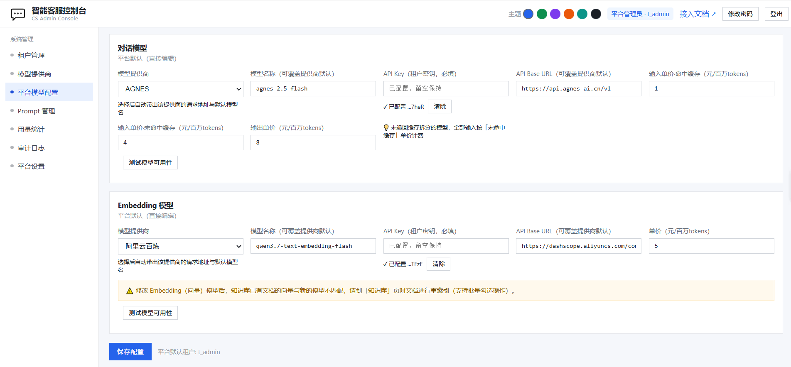
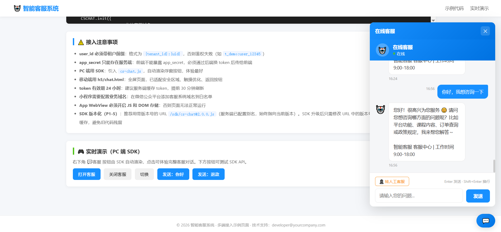
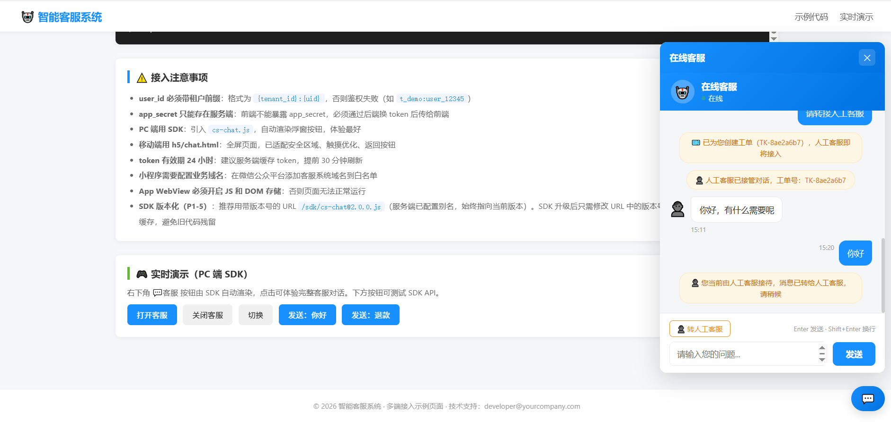
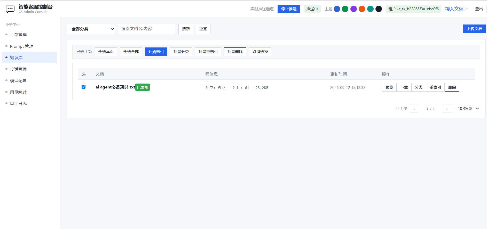

# 智能客服系统 · 快速体验

> ⚡ 极简图文版：5 分钟跑通「部署 → 配置模型 → AI 对话 → 转人工」，快速验证系统可用性。

---

## ① 部署启动（2 分钟）

```bash
git clone https://github.com/myrockey/ai_customer_service.git
cd ai_customer_service
cp .env.example .env      # 生产/本地按需修改密钥
docker compose up -d --build            # 一键拉起全部服务
docker compose ps                       # 等 1~2 分钟，全部 healthy
```

服务就绪后访问：

| 入口 | 地址 |
|------|------|
| 管理后台 | http://127.0.0.1:8080/admin/ |
| SDK 演示页 | http://127.0.0.1:8080/sdk/ |

**默认账号**：平台管理员 `admin_key` / `admin_secret`

---

## ② 关键第一步：后台配置平台模型（必须！）

> ⚠️ **必须先配置模型，AI 对话才能生效。**

1. 打开管理后台 `http://127.0.0.1:8080/admin/`，用平台管理员密钥登录
2. 左侧菜单 → **平台模型配置**
3. 配置两项模型：

| 配置项 | 操作 |
|--------|------|
| **对话模型** | 选提供商（如 DeepSeek/AGNES）→ 填模型名 → 填 API Key → 点【测试模型可用性】验证 |
| **Embedding 向量模型** | 选提供商 → 填 Key → 测试连通性 |

4. 点【保存配置】→ 配置自动广播到 Agent，立即生效

---

## ③ 体验 AI 对话（1 分钟）



1. 管理后台顶部点 **「接入文档」** → 跳到 SDK 演示页 `http://127.0.0.1:8080/sdk/`
2. 点右上角 **「实时演示」** → 页面跳转到实时演示位置 → 点右下角聊天图标自动弹出**在线客服浮窗**
3. 直接输入消息发送 → AI 立即回答（流式输出）
4. 页面试一试：**打开客服 / 关闭客服 / 发送：你好 / 发送：退款**

---

## ④ 体验转人工全流程（2 分钟）



1. 在客服浮窗输入「**请转接人工客服**」
2. 系统自动创建工单（如 `TK-8ae2a6b7`），提示"人工客服即将接入"
3. **客服端**：另开浏览器登录管理后台（用租户账号 `demo_key/demo_secret`）→ **工单管理** → 看到该工单 → 点开右侧对话窗 → 点接管对话即可【发送回复】
4. 用户端实时收到客服回复，对话全程可见

> 💡 管理后台顶部「实时推送通道」开启后，工单/消息实时刷新，无需手动点刷新。

---

## ⑤ 补充体验：知识库问答

1. 管理后台（租户账号）→ **知识库** → 点【上传文档】选择分类上传（如 txt/md）
2. 等待状态变为 **已索引**
3. 回到客服浮窗提问文档相关内容 → AI 会基于知识库回答
4. 修改了 Embedding 模型？→ 知识库勾选文档 → **批量重索引**

---

## 常见问题速查

| 现象 | 检查 |
|------|------|
| 发消息 AI 无响应 | 平台模型配置：对话模型是否配置、Key 是否正确、测试是否通过 |
| 知识库检索不到 | 文档状态是否为「已索引」；换 Embedding 模型后是否重新索引 |
| 登录报鉴权失败 | user_id 格式必须 `{租户ID}:{用户ID}`（如 `t_demo:user_1`） |
| 容器不健康 | `docker compose ps` 看哪个服务；`docker compose logs -f agent` 看 AI 服务日志 |

---

## 基础运维命令

```bash
docker compose ps                 # 查看容器状态
docker compose logs -f agent      # AI 对话核心服务日志
docker compose logs -f go         # 网关日志
docker compose restart            # 重启全部服务
docker compose up -d --build      # 更新代码后重建启动
```

> 完整功能说明见 [README.md](./README.md) · 详细接入见 [产品使用说明文档.md](./产品使用说明文档.md)
